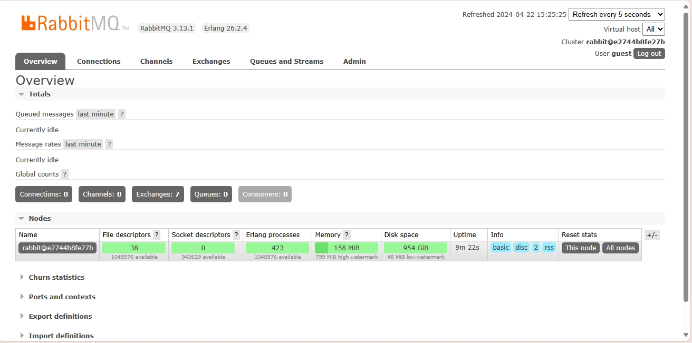
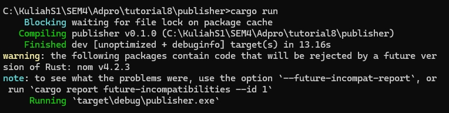
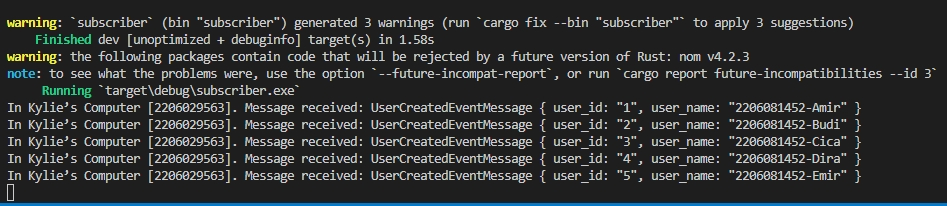
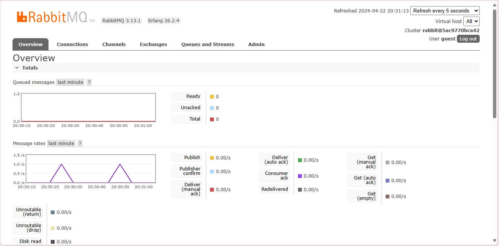

#Reflection 1
1. Ada 5 data yang di publish oleh program ke message broker dalam satu kali run. Hal ini dapat dilihat dari function main yang melakukan pemanggilan publish_event() sebanyak 5 kali, dimana tiap kali mengirimkan satu data.

2. Program subscriber dan publisher memiliki url yang sama karena menggunakan satu tempat yang sama untuk berkomunikasi. Perbedaannya adalah publisher akan mengirimkan data ke message queue sedangkan subscriber sebagai listener yang mengambil data dari message queue. Jika url nya berbeda, keduanya tidak akan bisa berkomunikasi.

<b>Mencoba membuka RabbitMQ sebagai message broker</b>

<b>Mencoba mengirim dan memproses event</b>

Pada screenshot diatas terlihat bahwa program publisher berhasil di run dan mengirimkan data pada subscriber melalui message broker. Keberhasilan dari pengiriman data ini terlihat dari console subsriber yang berhasil mendapatkan dan menampilkan data yang tadi ditulis pada program publisher.

<b>Mencoba menjalankan program publisher berulang kali</b>

Terlihat bahwa spike muncul pada grafik message rates. Message rates ini merupakan grafik yang menunjukkan jumlah message yang dikirim tiap detiknya. Spike ini muncul setiap kali dijalankan perintah cargo run pada program publisher. Hal ini menunjukkan adanya message yang terkirim setiap program publisher dijalankan, maka menyebabkan spike.